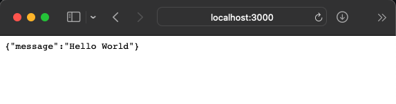

# Hello, DevSpace!

This is a simple introduction to using DevSpace with a Python [FastAPI](https://github.com/tiangolo/fastapi) project.


## What Are We Doing Here?

So, what are we doing here? Let's assume you are a Python developer (you probably are if you are reading this!) 
working on a simple FastAPI application that will live in a Kubernetes cluster.

You can, of course, run your application locally while you are developing it, and that may be a great way to get 
started. At some point, however, you will need to get this application running in a Kubernetes cluster -- in a way that 
will look much more similar to what it will look like in production. 

Re-building and pushing an image to an image repository, and then re-rolling out a deployment is one way to achieve 
this, but it is *not* a fun way to do it! *[There must be a better way!](https://youtu.be/p33CVV29OG8?t=566)*


And of course, there is! DevSpace's purpose in life is to make developing applications that live in Kubernetes easy. 
This very simple example will walk you through setting up a tiny FastAPI web application that you can work on live 
*in* a Kubernetes cluster.


## The Set-Up

If you haven't played with FastAPI before, you are missing out! It is a great project that builds on [Starlette](https://www.starlette.io) and 
[Pydantic](https://pydantic-docs.helpmanual.io) to give you an amazing web and API development experience. For this 
DevSpace example we will create the simplest possible FastAPI web server -- a web server that will listen at the 
root path and simply return a message to our page visitor.

The actual code to accomplish this is quite simple, and is copied directly from the FastAPI documentation:

```python
from fastapi import FastAPI

app = FastAPI()


@app.get("/")
async def root():
    return {"message": "Hello, World!"}
```

This code lives in our `app` directory in the `main.py` module.

If you would like to test this out on your local machine prior to getting it running in Kubernetes you will need to 
create a new virtual environment and install the requirements in `requirements.txt`. You can accomplish this like:

```shell
python3.10 -m venv venv
source venv/bin/activate
python3.10 -m pip install -r requirements.txt
```

Once you've created and activated your virtual environment and installed the requirements you can run the app with 
uvicorn like so:

```shell
uvicorn app.main:app --host 0.0.0.0 --port 80
```

After that you can open a browser to `http://localhost:80` and you should see our simple message printed out.


## Containerizing

OK, now that we have a functional web app (and it just has so much functionality, doesn't it!) we need to 
containerize it if we want to be able to deploy it in Kubernetes!

We'll do this with a very simple Dockerfile that builds form the `python:3.10.7-slim image`. In this Dockerfile we'll 
create a working director `hello-devspace`, copy our `requirements.txt` file into that directory, and install the 
requirements. After that we simply copy our `app` directory (which contains all of our code required for the 
application) into the image.

The last things we need are an `ENTRYPOINT` and a `CMD` (we could just stuff it all into one but we'll split things 
out nicely). Our entrypoint will be to run `uvicorn` pointing at our `app.main:app` module. Our command will be the 
extra arguments that we want to pass to uvicorn -- in our case the `--host` flag set to `0.0.0.0` (to bind to all 
interfaces on our container) and the `--port` flag to set the listen port to `80`.

You can check out the complete Dockerfile [here](./Dockerfile).


## What's Next?

Normally your next step would be to build the container image and push it *somewhere*. We of course still need to 
build this image and push it somewhere, but now we can let DevSpace handle that for us.

As for the pushing the image to *somewhere* thing -- you do need to be able to get this image to somewhere your 
cluster can pull it from. If you are doing development locally on Minikube/Docker Desktop/something similar, you may 
be able to simply build the image and have it be accessible from the cluster. But, what if you are doing development 
on a remote cluster or a cluster spun up with k3d or similar? Well, we've got great news for you! DevSpace will 
automatically spin up a registry adjacent to your pods that the parent Kubernetes cluster will be able to pull 
images from! If for some reason you want to build/push to a different registry, check out the next "simple-project" 
example where we'll show you how to do that as well.

The only thing left to do is to deploy our application into a Kubernetes cluster. In this case there is a very 
simple `deployment.yaml` manifest to do just that. This manifest will create a simple deployment, deploying a single 
pod of running our application container.

For "production" use, we may be "done" at this point -- we can build, push, and deploy the application, but if we 
are still in the process of developing our app, and want to try that out in a cluster, we are just getting started. 
As mentioned in the introduction, you *could* of course build, push, and (re-)deploy every time you want to make a 
change to your application, but that would be tedious, and not at all awesome.

This is where DevSpace comes in! We can use DevSpace to not only deploy our real application, but more importantly, 
and more to its intended purpose, we can use it to streamline the in-cluster development process of our application!


## Enter DevSpace

To use DevSpace, you simply need to install the DevSpace CLI 
(instructions [here](https://devspace.sh/docs/getting-started/installation)), and to have a `devspace.yaml` 
configuration file telling DevSpace how you want to work with your application. As this is the "hello, world" 
Python/DevSpace example, we'll be keeping our `devspace.yaml` file pretty simple as you can see here:

```yaml
version: v2beta1
name: python-hello-devspace

vars:
  IMAGE: python-hello-devspace
  DEVSPACE_FLAGS: "-n python-hello-devspace"

images:
  hello-devspace:
    image: ${IMAGE}
    dockerfile: ./Dockerfile
    rebuildStrategy: ignoreContextChanges

deployments:
  hello-devspace:
    kubectl:
      manifests:
        - manifests/

dev:
  hello-devspace:
    imageSelector: ${IMAGE}
    ports:
      - port: 3000:80
    sync:
      - path: ./app/:/hello-devspace/app/
    terminal:
      command: uvicorn app.main:app --host 0.0.0.0 --port 80 --reload
```

This `devspace.yaml`, has four major sections that pretty much all your `devspace.yaml` files will end up having:

1. `vars`: not strictly mandatory, but certainly nice to have! This is where we can define some variables that we 
   will refer to throughout our DevSpace config. In this case we are setting:
   - `IMAGE`: the name of the image we are building. 
   - `DEVSPACE_FLAGS`: is a "special" variable that allows you to set any flags you would normally pass to the 
     DevSpace CLI as a variable -- in this case we are passing `-n python-hello-devspace` which will tell DevSpace 
     to deploy our application into the namespace `python-hello-devspace`


2. `images`: is an object that contains all the images we will be building/pushing for our application.

    In this case we only have the one image `hello-devspace`. In the image definition we define the image name 
    (which we pull from our variables), the dockerfile used to build the image, and the `rebuildStrategy`. This last 
    one tells DevSpace when it needs to rebuild the image -- in this case we want to ignore changes in our Docker 
    context and only re-build the image when the Dockerfile changes (because we will be live syncing the actual 
    application code to the container, thus there is no need to rebuild the container while developing!).


3. `deployments`: is what it sounds like! This section defines how DevSpace should deploy our application. In this 
   case we simply refer to the Kubernetes manifests in the `manifests` directory.


4. `dev`: DevSpace, as the name would imply, is about helping you develop faster/easier in Kubernetes -- the `dev` 
   section is where we tell DevSpace how to help us do just that. In this example we have four important fields here:

    1. `imageSelector`: this field needs to match the image of a container in our deployment -- it tells DevSpace 
       which pod to update with our development setup.
    2. `ports`: tells DevSpace to create a tunnel(s) between our container and our local machine -- this way we can 
       easily access our application without needing to have an ingress setup. In this case we are exposing port 80 
       of our container on our local machines port 3000.
    3. `sync`: perhaps the most important one! `sync` tells DevSpace what files/directories to sync between our 
       local machine and the development container. In this case we will sync the whole "app" directory. As you make 
       changes to your local files DevSpace will automagically sync those changes out to the container!
    4. `terminal`:  allows us to connect to the development container and execute any command. In this example we 
       are running *mostly* the same command that our "production" container would (as defined in the Dockerfile), 
       with the addition of the `--reload` flag which allows uvicorn to hot-reload as we make changes to our code.


That's pretty much all there is to it! With this configuration in place we can now have DevSpace build, push, and 
deploy our application. Critically, we can now deploy our application in "dev" mode -- meaning that we can deploy 
our application to a Kubernetes cluster, make changes on our local machine, and have those changes automatically 
synced to the cluster. In this case, we even have automatic reloading of our application thanks to uvicorn (though 
it is worth noting that you can make this work with just DevSpace even if you don't have this functionality via 
uvicorn or similar!).


## Enough Already, Let's Do The Things!

At this point we've covered the basics of the FastAPI app, the Dockerfile, and of course DevSpace itself -- it's 
time to actually deploy this application!

From this directory run `devspace dev` to fire up the application in "dev" mode. You should see some output similar 
to the following:

```shell
$ devspace dev
info Using namespace 'python-hello-devspace'
info Using kube context 'loft-vcluster_devspace-dev_devspace-dev_loft-cluster'
build:hello-devspace Ensuring image pull secret for registry: 172.31.254.11...

< SNIP >

deploy:hello-devspace Applying manifests with kubectl...
deploy:hello-devspace deployment.apps/devspace-example-python-simple created
deploy:hello-devspace Successfully deployed hello-devspace with kubectl
dev:hello-devspace Waiting for pod to become ready...
dev:hello-devspace Selected pod devspace-example-python-simple-devspace-6c5c8b4dfc-5nfkc
dev:hello-devspace ports Port forwarding started on: 3000 -> 80
dev:hello-devspace sync  Sync started on: ./app/ <-> /hello-devspace/app/
dev:hello-devspace sync  Waiting for initial sync to complete
dev:hello-devspace sync  Initial sync completed
dev:hello-devspace term  Opening shell to python-web-server:devspace-example-python-simple-devspace-6c5c8b4dfc-5nfkc (pod:container)
INFO:     Will watch for changes in these directories: ['/hello-devspace']
INFO:     Uvicorn running on http://0.0.0.0:80 (Press CTRL+C to quit)
INFO:     Started reloader process [359] using StatReload
INFO:     Started server process [361]
INFO:     Waiting for application startup.
INFO:     Application startup complete.
```

After DevSpace is done building and pushing the container image, it will deploy our Kubernetes manifest. At this 
point DevSpace does some magic for us! DevSpace will find our deployment that we want to develop against (based on 
what we defined in the `dev` section of the configuration), and automatically scale that deployment down, creating a 
*new* deployment in its place. This new deployment will look *almost* the same as our original, with the important 
exception that DevSpace will have modified the containers entrypoint command.

This new container will simply run a `sleep` command so that it stays running and does not exit. Once the container is 
up and running, DevSpace will automatically connect to it and execute the command we gave it in the `dev` section of 
the config -- in this case that means it will run `uvicorn app.main:app --host 0.0.0.0 --port 80 --reload`.

In addition to "patching" our entrypoint and running our dev command, DevSpace will also have exposed the port(s) 
that we defined. You should now be able to access your application at `http://localhost:3000`.



Not too shabby! This is cool, DevSpace gives us a repeatable, simple, IaC-friendly way to define our development 
environment with real Kubernetes clusters ([or virtual ones!](https://github.com/loft-sh/vcluster)), but even cooler 
is that we can now do our development essentially "locally", while having it automatically reflected on the pod 
running in our cluster.

Update the `app/main.py` message dictionary being returned from the `root` function to say something else:

```python
@app.get("/")
async def root():
    return {"message": "Hello, DevSpace!"}

```

As soon as you (or your editor) save the file you should see that uvicorn picks up the changes and reloads the web app:

```shell
WARNING:  StatReload detected changes in 'app/main.py'. Reloading...
INFO:     Shutting down
INFO:     Waiting for application shutdown.
INFO:     Application shutdown complete.
INFO:     Finished server process [361]
INFO:     Started server process [364]
INFO:     Waiting for application startup.
INFO:     Application startup complete.
```

Refreshing your browser tab you should see your new message:


🔥 Nice! 🔥


## Cleaning Up

Now that you've probably finished adding the really cool feature that you were working on, it's time to clean up. 
DevSpace makes tidying up the resources you deployed a breeze. Simply running `devspace purge` will remove any 
deployment objects deployed via DevSpace:

```shell
$ devspace purge
info Using namespace 'python-hello-devspace'
info Using kube context 'loft-vcluster_devspace-dev_devspace-dev_loft-cluster'
dev:hello-devspace Stopping dev hello-devspace
dev:hello-devspace Scaling up Deployment devspace-example-python-simple...
purge:hello-devspace Deleting deployment hello-devspace...
purge:hello-devspace Successfully deleted deployment hello-devspace
```

And with that you've got the basics of DevSpace down. In the other examples we'll focus more on some DevSpace/Python 
specifics, and how you can best use DevSpace when developing in Python!
