# Debugging

Debugging your applications running remotely in a Kubernetes cluster can be a real pain, lucky for us, DevSpace 
gives us a few very handy tools to make this experience a breeze. 


## What Are We Doing Here?

This example is all about *debugging* -- but to do that we need to have *something* to debug! This section builds 
upon the Star Wars API from the [previous example](../02-fastapi-tortoise) by adding a very simple "client" that 
queries the API and "reports" (prints 😅) some output. We'll use DevSpace to build, deploy, and of course, debug this 
little "client" application.


## The Set-Up

For this example the client application is a very simple (`httpx`](https://www.python-httpx.org) utility. The main 
function of this app just runs a while loop that queries some random endpoints from our API, printing out the 
results as it goes.

As you may have guessed, we can't just deploy this client in a vacuum, we *also* need to deploy the application from 
the previous example, to do that, and to handle the containerization of our client app, we need to jump straight to 
our `devspace.yaml`!


## Enter DevSpace

There are a few major differences in the `devspace.yaml` file from the previous examples.

- We have a new config field `dependencies`
- The deployment of the client app is using the component helm chart instead of manifests
- There is an additional field in the "dev" configuration for our client app `devImage` (and an associated "image" 
  section!)


The `dependencies` section of config is used to define... dependencies! You can find the docs page for dependencies 
[here](https://devspace.sh/docs/configuration/dependencies/), but the short of it is that we can list *other* 
`devspace.yaml` definitions via local paths or a git repository. DevSpace will then include these other 
configurations in our "local" DevSpace configuration. In this case we are including the `02-fastapi-tortoise` config 
like so:

```yaml
dependencies:
  fastapi-tortoise:
    path: ../02-fastapi-tortoise
```

Next up, rather than defining and deploying manifests, this client application is set up to be deployed via the 
DevSpace component helm chart -- or basically a helm chart that we can add containers into for quick and easy 
deployment. Below you can see that we reference the `charts.devs.pace.sh/component-chart` and simply pass in a small 
definition for our container.

```yaml
deployments:
    simple-project-client:
      helm:
        chart:
          name: component-chart
          repo: https://charts.devspace.sh
        values:
          containers:
            - image: ${CLIENT_IMAGE}
              env:
              - name: NAMESPACE
                value: ${DEVSPACE_NAMESPACE}
```

Another new change in the DevSpace config is the addition of a "dev" image for our application. In previous 
examples we have simply deployed our "prod" image(s) and relied on either uvicorn or DevSpace to reload our 
application as changes have occurred. This time around we are introducing this "dev" image which will be built from 
the `Dockerfile.dev` dockerfile as specified in the images section:

```yaml
images:
  < SNIP >
  client-dev:
    image: ${CLIENT_DEV_IMAGE}
    context: ./
    dockerfile: ./Dockerfile.dev
    rebuildStrategy: ignoreContextChanges
```

We then refer to this dev image in our "dev" config like so:

```yaml
dev:
  simple-project-client:
    imageSelector: ${CLIENT_IMAGE}
    devImage: ${CLIENT_DEV_IMAGE}
```

When we deploy our application in "dev" mode (via `devspace dev`) DevSpace will automatically replace the 
"production" image with our "dev" image. The idea here is that we can have different/extra tooling in the images we 
use for development. For example, in this case the `Dockerfile.dev` installs some tooling that is *not* present on 
the "production" `Dockerfile`, things like vim, ping, and httpie (more on this later).

At this point we should be ready to test out our new client application and do some live debugging!


## Enough Already, Let's Do The Things!

To get things rolling run `devspace dev`. DevSpace will launch the "02-fastapi-tortoise" app, and our new client app,
replacing the client app's image with our defined "dev" image. Our "dev" configuration specifies that DevSpace 
should open a terminal and run the `devspace_start.sh` script. This simple shell script sets up a host alias of 
"api" pointing to the internal DNS name of the API service running in the deployment from the imported dependency 
"02-fastapi-tortoise", then simply drops to `bash` so you can do whatever development/debugging you want to do!

```shell
< SNIP >
dev:simple-project-client Waiting for pod to become ready...
dev:simple-project-client Selected pod simple-project-client-devspace-f69d69fbd-9dkg2
dev:simple-project-client sync  Sync started on: ./client/ <-> /client
dev:simple-project-client sync  Waiting for initial sync to complete
dev:simple-project-client sync  Initial sync completed
dev:simple-project-client ssh   Port forwarding started on: 10858 -> 8022
dev:simple-project-client ssh   Use 'ssh simple-project-client.python-debugging.devspace' to connect via SSH
dev:simple-project-client term  Opening shell to container-0:simple-project-client-devspace-f69d69fbd-9dkg2 (pod:container)
root@simple-project-client-devspace-f69d69fbd-9dkg2:/client#
```

Because this section is all about debugging -- let's assume that you have got this environment set up, but have not 
yet wrote the Python client application. The first thing you need to do is to get access to the API that the client 
will be connecting to. Perhaps this API is only exposed inside your cluster for whatever reason -- how can you 
develop/test against that? Well, as you have already seen, DevSpace has already helped us out immensely by directly 
dropping us into our Dev container -- a container that we have already installed some helpful dev tools on.

From the container you can use [`httpie`](https://httpie.io) to interact with the Star Wars API to test things out:

```shell
root@simple-project-client-devspace-f69d69fbd-9dkg2:/client# http api/planet/1
HTTP/1.1 200 OK
content-length: 324
content-type: application/json
date: Fri, 16 Sep 2022 15:46:08 GMT
server: uvicorn

{
    "climate": "arid",
    "created_date": "2014-12-09T13:50:49.641000+00:00",
    "diameter": 10465,
    "gravity": "1 standard",
    "id": 1,
    "name": "Tatooine",
    "orbital_period": 304,
    "population": 200000,
    "rotation_period": 23,
    "surface_water": "1",
    "terrain": "desert",
    "updated_date": "2014-12-21T20:48:04.175778+00:00",
    "url": "https://swapi.co/api/planets/1/"
}
```

**Note** `api` is an alias to the internal DNS name of the API service, this is set by the `devspace_start.sh`.

`httpie` is an awesome tool for quickly testing out HTTP endpoints. You can install any tools you'd like in your 
"dev" container image, all while never having to worry about bloating your "production" image!

Now that you've got the API all figured out, you can test out the client application by simply running `python main.py`:

```shell
root@simple-project-client-devspace-f69d69fbd-9dkg2:/client# python main.py
{
│   'id': 32,
│   'name': 'Chandrila',
│   'rotation_period': 20,
│   'orbital_period': 368,
│   'diameter': 13500,
│   'climate': 'temperate',
│   'gravity': '1',
│   'terrain': 'plains, forests',
│   'surface_water': '40',
│   'population': 1200000000,
│   'created_date': '2014-12-18T11:11:51.872000+00:00',
│   'updated_date': '2014-12-20T20:58:18.472000+00:00',
│   'url': 'https://swapi.co/api/planets/32/'
}
```

The application will run forever, randomly querying some people or planet object, printing it out, and sleeping for 
some randomized time.


## Yeah, But This Is Supposed To Be About Debugging?!

Right, so, debugging! When it comes ot debugging our simple client app we have a few options!

- Debug from the terminal, either via the shell DevSpace opened for us, by SSH'ing to the container, or by exec'ing 
  onto the container
- Debug with a remote interpreter (via your IDE)
- Debug with a remote IDE

Note that the following examples will demonstrate using PyCharm, if you prefer VSCode, you can check out the VSCode 
example in the docs [here](https://devspace.sh/docs/ide-integration/visual-studio-code).


### Debug From The Terminal

The first of these options is quite simple, get on the container in some fashion, and debug using PDB or print 
statements or whatever flavor of debugging you like! Note that in addition to simply dropping us off in the terminal 
as we have seen, this time around we have told DevSpace to also enable an SSH server on our container. Not only has 
DevSpace installed this tiny SSH server for us, it has also updated our local `~/.ssh/config` to make SSH'ing to the 
container super simple.

From another terminal simply run `ssh simple-project-client.python-debugging.devspace` to SSH directly to the 
container. You could of course find the pod name via kubectl and exec, but this is just a handy little shortcut we 
get for free from DevSpace!

```shell
$ ssh simple-project-client.python-debugging.devspace
root@simple-project-client-devspace-f69d69fbd-gfdct:/client#
```

From the container you can simply add breakpoints to your code wherever you'd like:

```python
    while True:
        choice = random.choice(choices)

        obj = choice_getters[choice](random.randint(1, choice_max[choice]))

        breakpoint()

        report(obj=obj)

        time.sleep(random.randint(1, 5))
```

And then run your program like normal, dropping into the debugger as soon as you hit your breakpoint:

```shell
root@simple-project-client-devspace-f69d69fbd-gfdct:/client# python main.py
> /client/main.py(77)main()
-> report(obj=obj)
(Pdb) l
 72
 73  	        obj = choice_getters[choice](random.randint(1, choice_max[choice]))
 74
 75  	        breakpoint()
 76
 77  ->	        report(obj=obj)
 78
 79  	        time.sleep(random.randint(1, 5))
 80
 81
 82  	if __name__ == "__main__":
(Pdb) dir()
['choice', 'choice_getters', 'choice_max', 'choices', 'max_people', 'max_planets', 'obj']
(Pdb) obj
{'id': 37, 'name': 'Roos Tarpals', 'height': 224, 'mass': 82, 'hair_color': 'none', 'skin_color': 'grey', 'eye_color': 'orange', 'birth_year': None, 'gender': 'male', 'planet_id': 8, 'created_date': '2014-12-19T17:32:56.741000+00:00', 'updated_date': '2014-12-20T21:17:50.385000+00:00', 'url': 'https://swapi.co/api/people/37/'}
(Pdb)
```

### Debug With A Remote Interpreter

Many modern Python IDEs support configuring *remote interpreters* -- that is, a Python environment that the IDE 
connects to remotely. The IDE can then use this remote Python environment to do all the IDE interpolation magic 
that gives us great features like auto-complete and jump to definition, etc..  In this example, we'll connect PyCharm 
to the system Python installation of our dev container. If you are using another editor chances are there is 
similar functionality, so check out your editor docs!

Head to the preferences page -- you can click on the cog icon on the top right of PyCharm to go here.

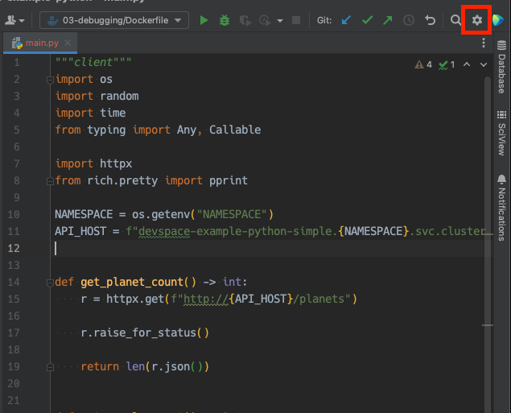

From there, expand the `Project` section, click on the `Python Interpreter` option, and select `Show All...` from 
the drop-down menu as shown below:

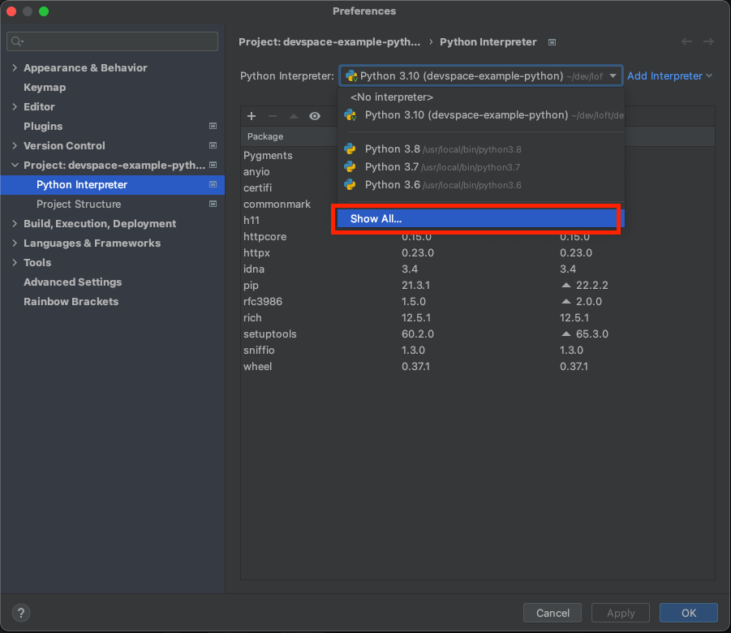

Next we'll add our remote interpreter via the SSH connection that DevSpace has exposed on our container. Click the ➕ 
icon, and then the `On SSH...` button:

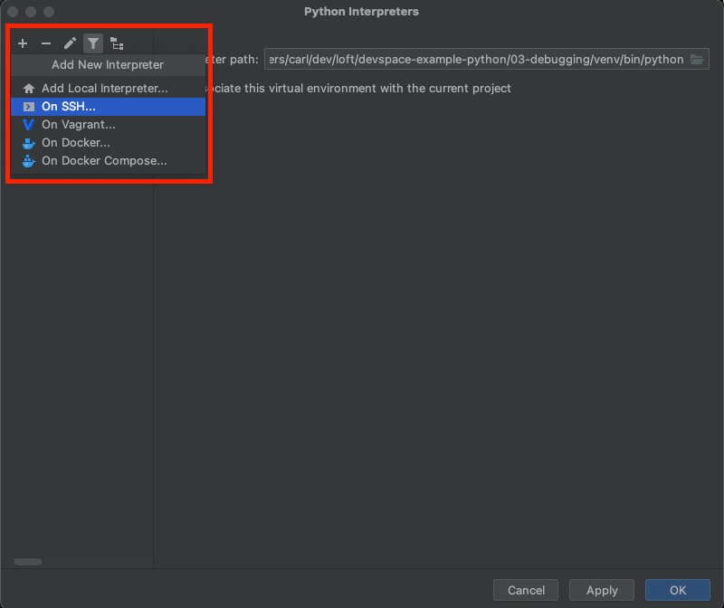

We now need to tell PyCharm how to SSH to our container. You will want to check out your `~/.ssh/config` file to 
grab the hostname and port of the container that DevSpace is exposing:

```shell
$ cat ~/.ssh/config
# DevSpace Start simple-project-client.python-debugging.devspace
Host simple-project-client.python-debugging.devspace
  HostName localhost
  LogLevel error
  Port 10483
  IdentityFile /Users/user/.devspace/ssh/id_devspace_rsa
  StrictHostKeyChecking no
  UserKnownHostsFile /dev/null
  User devspace
# DevSpace End simple-project-client.python-debugging.devspace
```

With this info we can fill in the dialog box in PyCharm:

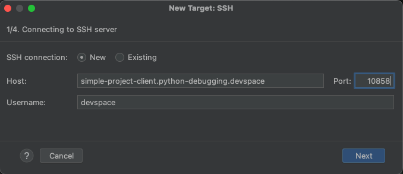

Clicking "Next" should bring up a screen showing that PyCharm successfully connected to the remote host:

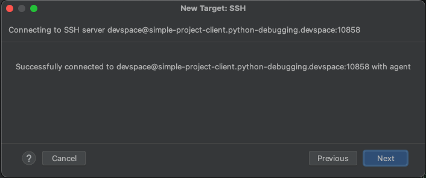

Clicking "Next" once more should show PyCharm successfully introspecting the remote server. Click "Next" yet again, 
and you should be prompted to tell PyCharm what interpreter on the remote host to use. For our example, we'll use 
the "System Interpreter".

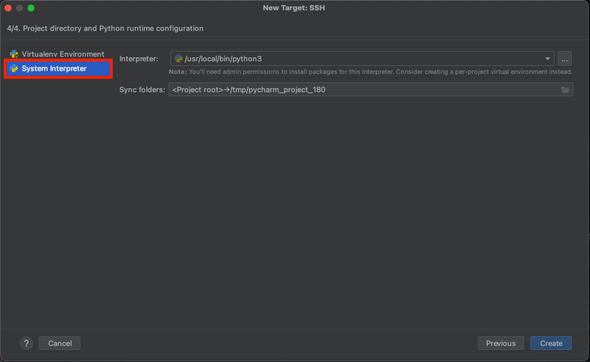

Now, anytime you use the "run" option in PyCharm, your code will be being executed on the remote container as you 
can see from the path shown here:

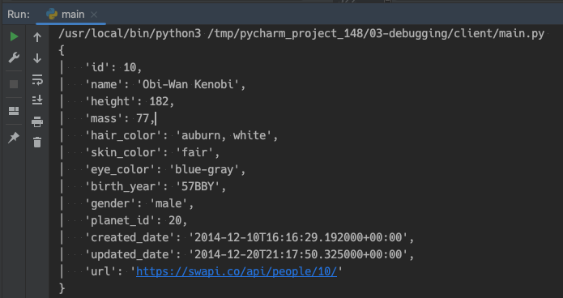

This holds true not only for *running*, but also for *debugging*. Set a breakpoint in your editor:

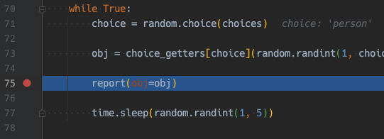

Then run the main program once more with the "debug" option:


You now have full PyCharm debugging support of your application that is running remotely in your Kubernetes cluster! 
Pretty cool!


### Debug With A Remote Editor

JetBrains IDEs have support for using *remote* editors, as in you have a "thin client" on your local machine, and 
the "full" editor runs on the remote device, in our case on a container in Kubernetes. DevSpace can help enable this 
remote editor by easily exposing your dev container via SSH as you've seen.

To set up a remote editor you can either use a JetBrains IDE that has support for JetBrains Gateway (PyCharm, for 
example), or you can download and install [JetBrains Gateway](https://www.jetbrains.com/remote-development/gateway/) 
directly.

Launch Gateway, or click "Remote Development" in the file menu of PyCharm.

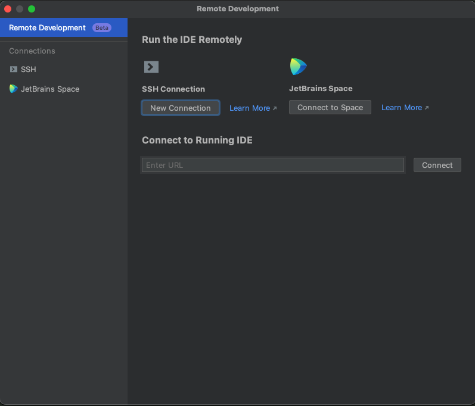

Similar to the remote interpreter section, you will need to grab the SSH host and port from your SSH config file:

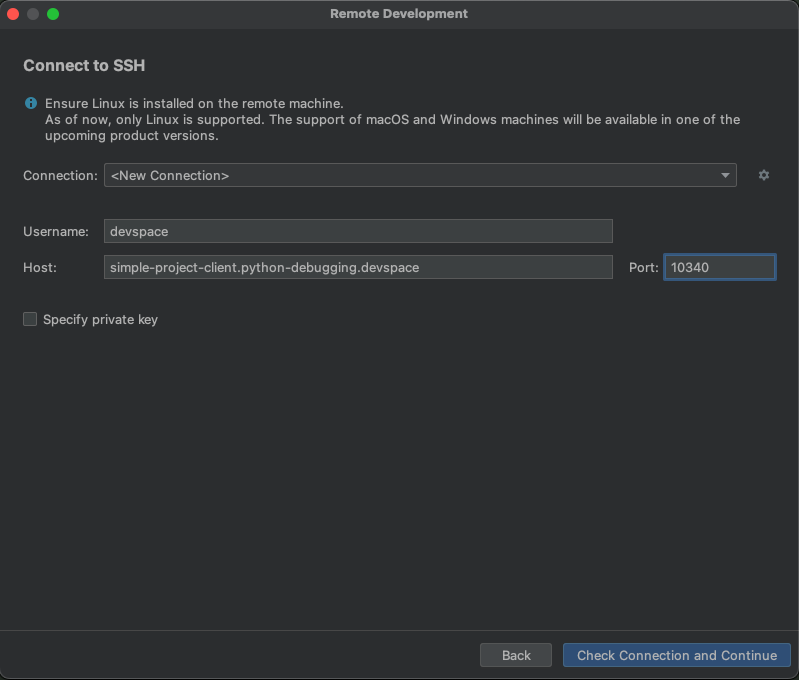

After that you can select the IDE version you want to use, and point to a project directory (in our case `/client`). 
The IDE will be installed in your container, and shortly you will have a new IDE, lightweight IDE window pop up!

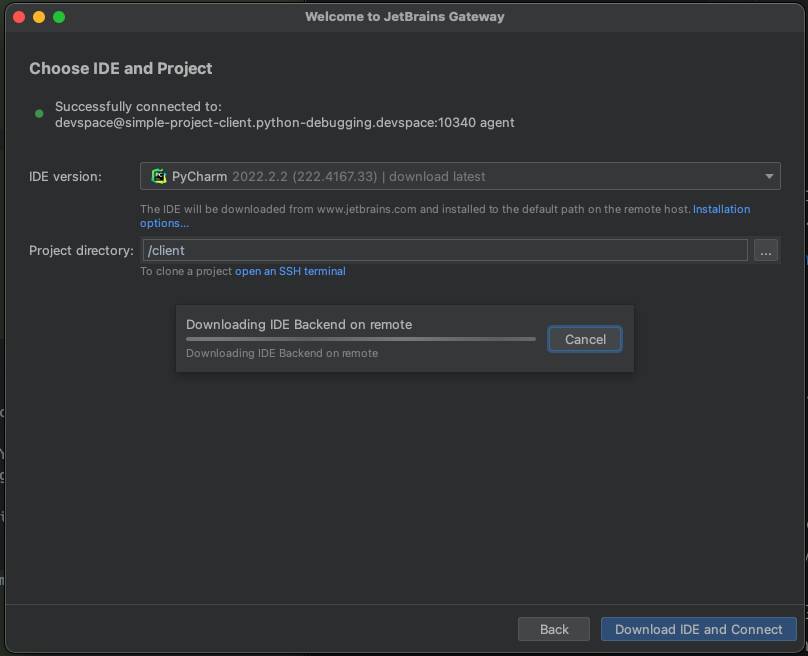

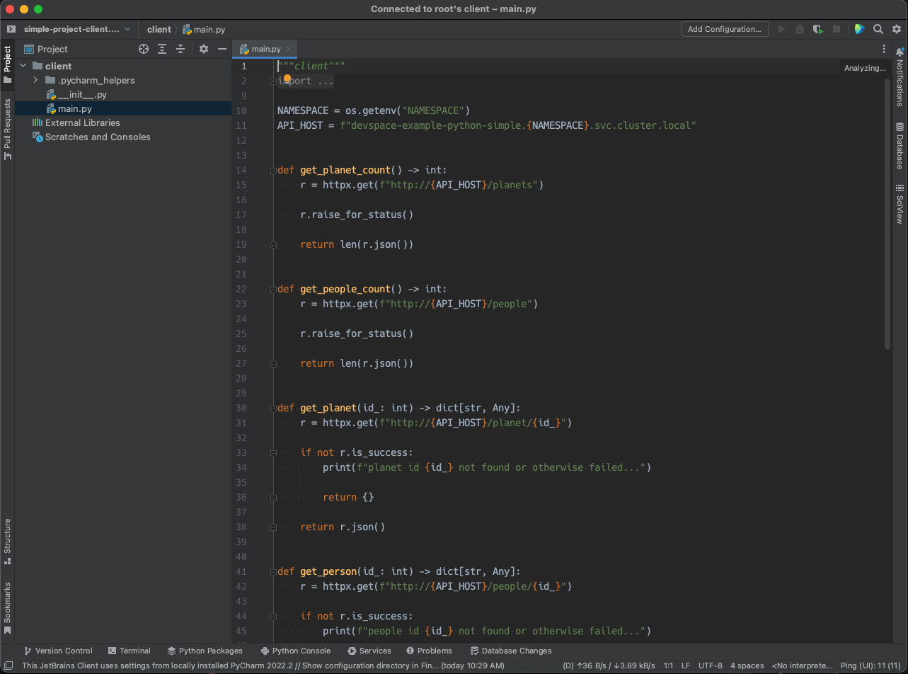

From here you can do all of your "normal" IDE things, including of course running and debugging your application!
